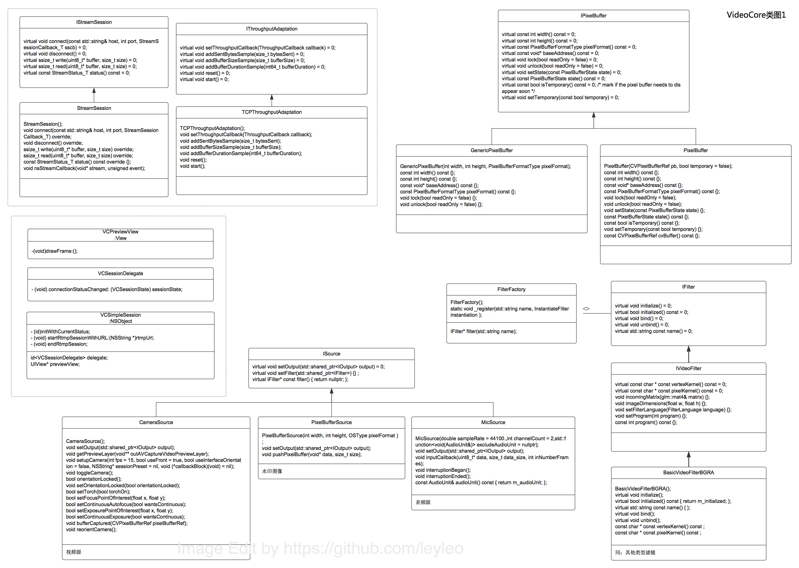
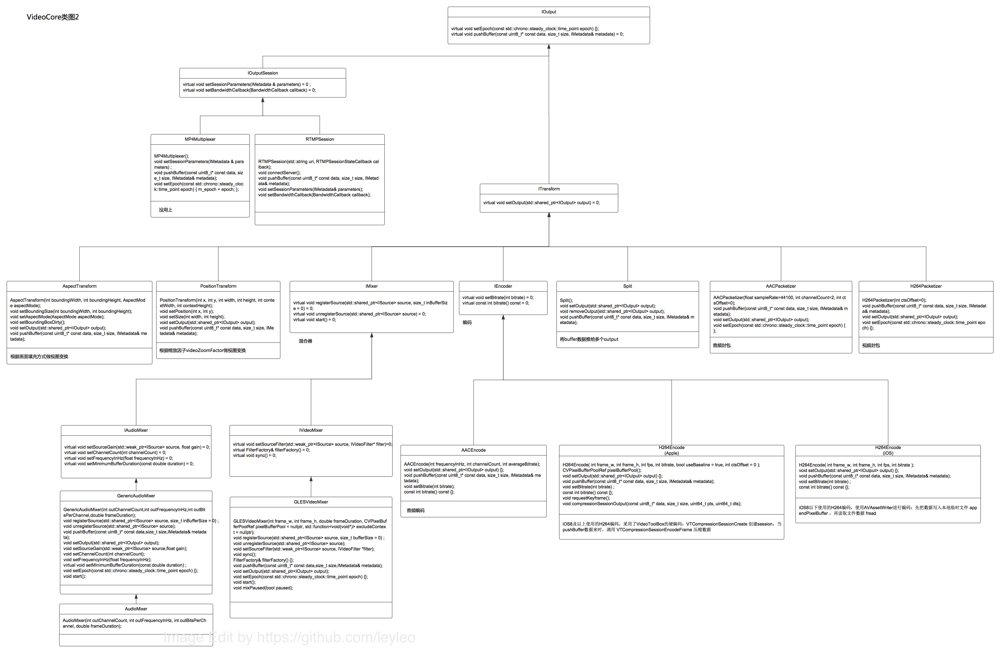
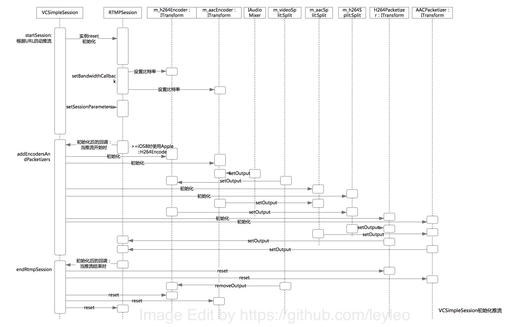
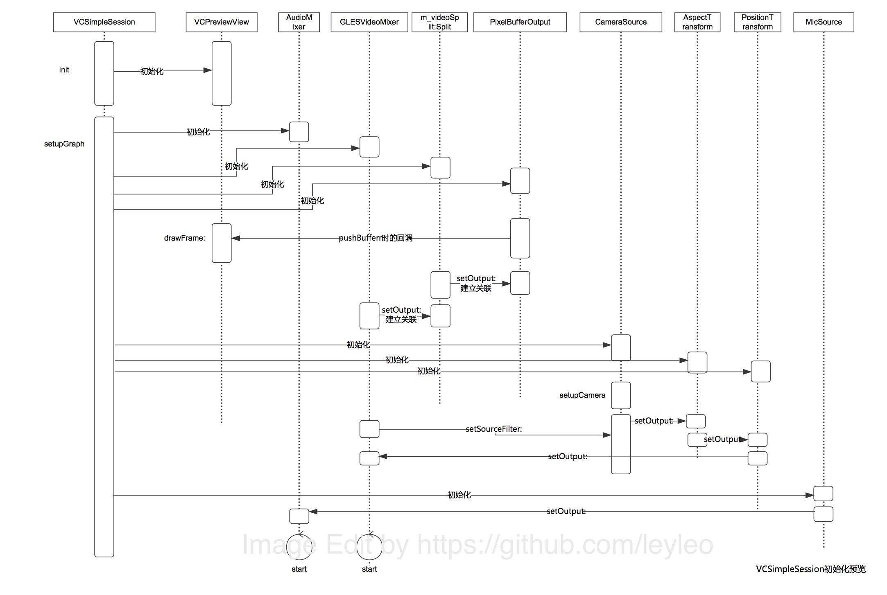
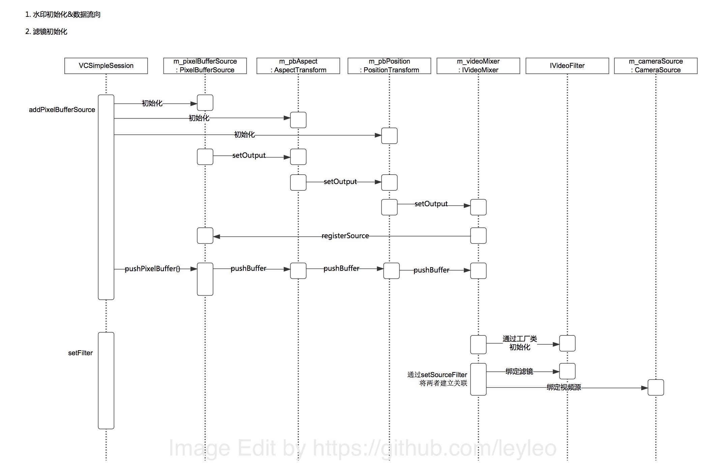
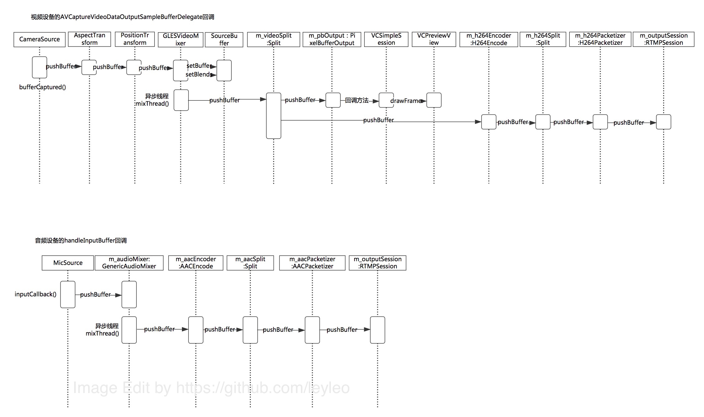

# ReadMe

## 文档索引

[API文档](./API.md)

[安装指南](./InstallGuide.md)

## 类图 

[点击查看大图：VideoCore类图1](./img/VideoCore类图1.jpg)

[点击查看大图：VideoCore类图2](./img/VideoCore类图2.jpg)

## 时序图

[点击查看大图：VCSimpleSession初始化推流](./img/VCSimpleSession初始化推流.jpg)

[点击查看大图：VCSimpleSession初始化预览](./img/VCSimpleSession初始化预览.jpg)

[点击查看大图：VCSimpleSession初始化特效](./img/VCSimpleSession初始化特效.jpg)

[点击查看大图：音视频Buffer传递过程](./img/音视频Buffer传递过程.jpg)